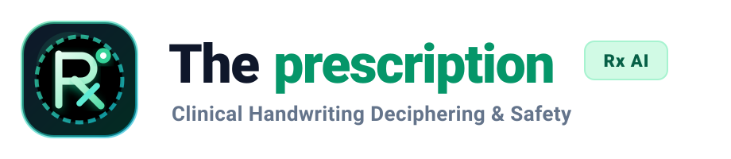

<div align="center">

# 🌐 Visit Official Website: [www.theprescription.in](https://www.theprescription.in)

> ### 🚀 **[👉 Click Here to Launch Live Web App: https://www.theprescription.in 👈](https://www.theprescription.in)**
> **Instantly scan handwritten prescriptions, check medicine interactions, and generate 24-hour patient schedules online.**

<br />



<p align="center">
  <strong>Intelligent Clinical Prescription Decoder, Drug Safety Analyzer & 24-Hour Patient Dosage Scheduler</strong>
</p>

[](https://www.theprescription.in)
[](https://render.com)
[](https://opensource.org/licenses/MIT)
[](https://nodejs.org)
[](https://react.dev)
[](https://www.typescriptlang.org)
[](https://tailwindcss.com)
[](https://ai.google.dev)

<p align="center">
  <a href="#-overview">Overview</a> •
  <a href="#-key-features">Key Features</a> •
  <a href="#-the-5-stage-clinical-vision-pipeline">Clinical Pipeline</a> •
  <a href="#-architecture">Architecture</a> •
  <a href="#-tech-stack">Tech Stack</a> •
  <a href="#-quick-start">Quick Start</a> •
  <a href="#-deployment-guide-render">Deployment</a> •
  <a href="#-api-reference">API Reference</a> •
  <a href="#-clinical-safety--disclaimer">Safety & Disclaimer</a>
</p>

</div>

---

## 🩺 Overview

Illegible doctor handwriting, complex Latin clinical abbreviations (`BD`, `TDS`, `QDS`, `PRN`, `AC`, `PC`), Look-Alike Sound-Alike (LASA) medications, and conflicting multi-drug regimens cause over **1.5 million preventable adverse drug events (ADEs)** worldwide every year.

**The Prescription** is an open-source, privacy-first healthcare AI application engineered to eliminate prescription ambiguity. Utilizing advanced multimodal computer vision, clinical pharmacopeia cross-referencing, and chronotherapy rules, it converts handwritten paper prescriptions, e-scripts, and lab orders into clear, verified, structured clinical schedules.

### Why The Prescription?
- **Zero-Retention Privacy**: Prescription images are processed entirely in volatile memory and never saved to databases, disk, or remote buckets.
- **Multi-Engine Vision Consensus**: Proprietary 5-stage verification checks stroke ligatures, spatial context, pharmacopeial databases, and dosage limits before proposing results.
- **Failover-Hardened Backend**: Built-in multi-key Gemini rotation pool with automatic fallback to Groq (Llama 3.2 Vision) or xAI Grok to guarantee 99.9% uptime.
- **Patient Empowerment**: Translates cryptic doctor notes into an intuitive 24-hour visual schedule and exportable PDF wallet cards for refrigerators and emergency kits.

---

## ✨ Key Features

| Feature | Description |
| :--- | :--- |
| ✍️ **Handwriting Decryption** | Multimodal OCR specialized in cursive handwriting, doctor scribbles, degraded paper, and low-contrast mobile camera captures. |
| 🔤 **Latin Shorthand Decoder** | Instant translation of clinical Rx abbreviations (`BD`, `TDS`, `SOS`, `HS`, `AC`, `PC`, `STAT`) into plain-language instructions. |
| ⚠️ **Dosage & Safety Guardrails** | Validates prescribed quantities against adult and pediatric toxicity boundaries, flagging hazardous over-dosages. |
| 🔄 **Drug-Drug & Food Interactions** | Identifies contraindications, synergistic interactions, and dietary warnings (e.g., grapefruit, dairy, alcohol, empty stomach). |
| 📅 **24-Hour Visual Timeline** | Maps daily medications into chronological time blocks: Morning (Empty Stomach/Breakfast), Afternoon, Evening, and Night. |
| 🏷️ **Generic Bioequivalents** | Cross-references brand-name drugs with standard generics (5,000+ catalog) to help patients save up to 80% on pharmacy bills. |
| 🧪 **Lab Orders Parser** | Extracts ordered diagnostic investigations (e.g., CBC, Lipid Panel, HbA1c, LFT, KFT) with prep instructions (fasting vs non-fasting). |
| 🖨️ **Printable Emergency Card** | One-click generation of vector-crisp, printable medication wallet schedules with emergency contact summaries via `jsPDF`. |
| 📚 **Medical Knowledge Base** | SEO-optimized educational articles, clinical pharmacology guides, RSS feed (`/feed.xml`), and Substack export. |

---

## 🔬 The 5-Stage Clinical Vision Pipeline

Prescriptions cannot be reliably parsed with standard generic OCR. The Prescription processes every document through a multi-pass clinical validation pipeline:

```mermaid
flowchart LR
    A["📸 Prescription Upload<br/>(Camera / File)"] --> B["Client-Side Preprocessing<br/>(1600px Max, Aspect Ratio Fix)"]
    B --> C["Stage 1: Stroke Ligature OCR<br/>(Cursive Character Extraction)"]
    C --> D["Stage 2: Spatial Zoning<br/>(Header, Rx Table, Lab Orders)"]
    D --> E["Stage 3: Shorthand Translation<br/>(Latin Rx & Frequency Parsing)"]
    E --> F["Stage 4: Dosage Boundary Check<br/>(Toxicity Limits & Unit Norm)"]
    F --> G["Stage 5: Pharmacopeia Consensus<br/>(Generic Mapping & LASA Check)"]
    G --> H["👥 Human-in-the-Loop Review<br/>(Interactive Patient Confirmation)"]
    H --> I["📅 24-Hour Intake Schedule<br/>& Vector PDF Wallet Card"]
```



1. **Stroke Ligature & Cursive Extraction**: Analyzes connected script, pen lifts, and stroke weights to reconstruct handwritten letter sequences.
2. **Spatial Layout & Context Zoning**: Segments the image into Doctor Header, Diagnostic Findings, Rx Medication List, Instructions, and Signature.
3. **Latin Shorthand Translation**: Converts medical frequency codes into localized schedules (e.g., `1 Tab PO TDS PC` $\rightarrow$ "Take 1 tablet by mouth three times daily after meals").
4. **Dosage Boundary & Form Factor Validation**: Normalizes units (`mg`, `mcg`, `ml`, `IU`) and flags values exceeding recognized therapeutic windows.
5. **Pharmacopeia Consensus & LASA Guard**: Matches names against international drug directories to prevent Look-Alike Sound-Alike dispensing mistakes.

---

## 🏗️ Architecture

```
the-prescription/
├── public/                     # Static assets, logos, icons, sitemap, RSS feeds
│   ├── theprescription-logo.svg
│   ├── theprescription-icon.svg
│   ├── robots.txt
│   ├── sitemap.xml
│   ├── feed.xml
│   └── llms.txt               # LLM indexing summary
├── src/
│   ├── components/            # React 19 UI component library
│   │   ├── PrescriptionUploader.tsx       # Drag-and-drop & camera capture
│   │   ├── PrescriptionResultView.tsx     # Full clinical results breakdown
│   │   ├── DailyScheduleTimeline.tsx      # Chronotherapy 24-hour visual schedule
│   │   ├── PrintableMedicationCard.tsx    # PDF generation & printable wallet card
│   │   ├── HumanInTheLoopVerificationCard.tsx # Low-confidence extraction confirmation
│   │   ├── MultiEngineConsensusCard.tsx   # Model consensus visualization
│   │   ├── MedicineLookup.tsx             # 5,000+ medicine instant search engine
│   │   ├── LabTestsSection.tsx            # Diagnostic blood & urine test parser
│   │   ├── AbbreviationDictionary.tsx     # Latin shorthand reference guide
│   │   └── BlogSection.tsx                # Medical education articles
│   ├── data/                  # Static medical catalogs & abbreviation databases
│   ├── utils/                 # Image downscaling, PDF generation, formatters
│   ├── App.tsx                # Main SPA application controller
│   └── main.tsx               # Client bootstrap & GA4 integration
├── server.ts                  # Production Express API & Gemini multimodal server
├── render.yaml                # Infrastructure-as-code blueprint for Render
├── .env.example               # Full environment variables template
├── package.json               # Dependencies, build scripts & metadata
└── tsconfig.json              # TypeScript compilation rules
```

---

## 💻 Tech Stack

| Domain | Technologies |
| :--- | :--- |
| **Frontend Framework** | [React 19](https://react.dev) + [TypeScript 5.8](https://www.typescriptlang.org) |
| **Styling & Design** | [Tailwind CSS v4](https://tailwindcss.com) + [Lucide Icons](https://lucide.dev) |
| **Build & Bundling** | [Vite 6](https://vite.dev) + [esbuild](https://esbuild.github.io) |
| **Backend Runtime** | [Node.js 20+](https://nodejs.org) + [Express 4](https://expressjs.com) + [tsx](https://github.com/privatenumber/tsx) |
| **AI / Multimodal Vision** | [Google Gemini 2.5 / 3 Flash](https://ai.google.dev) (`@google/genai`) |
| **Failover Multimodal** | [Groq](https://groq.com) (Llama 3.2 Vision) / [xAI Grok Vision](https://x.ai) |
| **Document Generation** | [jsPDF](https://github.com/parallax/jsPDF) + [jspdf-autotable](https://github.com/simonbengtsson/jsPDF-AutoTable) |
| **Email & Alerts** | [Nodemailer](https://nodemailer.com) + Multi-provider waterfall (Brevo, SendGrid, Resend) |
| **Production Deployment** | [Render](https://render.com) Web Service with native Node.js runtime |

---

## 🚀 Quick Start

### Prerequisites
- [Node.js](https://nodejs.org) version `20.18.0` or higher
- [npm](https://www.npmjs.com/) version `10.0.0` or higher
- A [Google Gemini API Key](https://aistudio.google.com/)

### 1. Clone the Repository
```bash
git clone https://github.com/ikingarmaan/The-Prescriptions.git
cd The-Prescriptions
```

### 2. Install Dependencies
```bash
npm install
```

### 3. Set Up Environment Variables
Copy `.env.example` to `.env`:
```bash
cp .env.example .env
```
Open `.env` and paste your Gemini API key:
```env
GEMINI_API_KEY="AIzaSyYourGeminiApiKeyHere"
```
*(Optional: Add a second key `GEMINI_API_KEY_2` for round-robin rotation, and `GROQ_API_KEY` for automatic fallback).*

### 4. Run Development Server
```bash
npm run dev
```
Open [http://localhost:3000](http://localhost:3000) in your browser. Live reloading is handled automatically by `tsx` and `vite`.

### 5. Production Build & Test
```bash
npm run build
npm start
```
The full application will compile into `dist/` and launch the high-performance unified Express server.

---

## ☁️ Deployment Guide (Render)

The Prescription is pre-configured for zero-friction deployment on [Render](https://render.com).

### Option A: Render Blueprint (Recommended)
This repository includes a [`render.yaml`](render.yaml) blueprint:
1. Log in to [dashboard.render.com](https://dashboard.render.com).
2. Click **Blueprints** $\rightarrow$ **New Blueprint Instance**.
3. Connect your repository `https://github.com/ikingarmaan/The-Prescriptions`.
4. Enter your `GEMINI_API_KEY` in the environment prompt and click **Apply**.

### Option B: Manual Web Service Configuration
If setting up manually as a **Web Service**:

| Setting | Value |
| :--- | :--- |
| **Environment** | `Node` |
| **Node Version** | `20.18.0` (handled automatically via `.node-version`) |
| **Branch** | `main` |
| **Build Command** | `npm run build` |
| **Start Command** | `npm start` |

#### Environment Variables in Render:
Add the following in your Render dashboard under **Environment**:
```env
NODE_ENV=production
GEMINI_API_KEY=AIzaSyYourGeminiApiKeyHere
GEMINI_API_KEY_2=AIzaSyYourSecondaryKeyHere (Optional)
GROQ_API_KEY=gsk_YourGroqBackupKeyHere (Optional)
VITE_GA_MEASUREMENT_ID=G-2ESSBNEX33 (Optional)
APP_URL=https://your-service-name.onrender.com
```

---

## ⚙️ Environment Variables Reference

| Variable | Required | Description | Example |
| :--- | :---: | :--- | :--- |
| `GEMINI_API_KEY` | **Yes** | Primary Google Gemini Vision API key | `AIzaSy...` |
| `GEMINI_API_KEY_2` | No | Secondary Gemini key for round-robin load balancing & 429 backoff | `AIzaSy...` |
| `GROQ_API_KEY` | No | Fallback vision model (Groq Llama 3.2 90B Vision) | `gsk_...` |
| `XAI_API_KEY` | No | Secondary backup vision model (xAI Grok Vision) | `xai-...` |
| `PORT` | No | HTTP port for Node.js Express server (Default: `3000`) | `3000` |
| `NODE_ENV` | No | Server environment (`development` or `production`) | `production` |
| `APP_URL` | No | Public production URL for canonical meta tags | `https://www.theprescription.in` |
| `VITE_GA_MEASUREMENT_ID` | No | Google Analytics 4 Measurement ID | `G-2ESSBNEX33` |
| `EMAIL_PROVIDER` | No | Preferred transactional email service (`brevo` / `sendgrid` / `resend` / `smtp`) | `brevo` |
| `BREVO_API_KEY` | No | Brevo API key for contact form routing | `xkeysib-...` |
| `SENDGRID_API_KEY` | No | SendGrid API key | `SG....` |
| `RESEND_API_KEY` | No | Resend API key | `re_...` |
| `EMAIL_USER` | No | Gmail or SMTP username for notifications | `user@gmail.com` |
| `EMAIL_APP_PASSWORD` | No | 16-character Google App Password for SMTP | `abcd efgh ijkl mnop` |
| `GOOGLE_SHEET_WEBHOOK_URL`| No | Google Apps Script URL for logging inquiries to Google Sheets | `https://script.google.com/...` |

---

## 📡 API Reference

The backend Express server exposes production REST endpoints for prescription intelligence:

### `POST /api/analyze-prescription`
Analyzes an uploaded prescription image and returns comprehensive clinical extraction.

**Request Body** (`multipart/form-data` or `application/json`):
```json
{
  "image": "data:image/jpeg;base64,...",
  "mimeType": "image/jpeg",
  "clientConsent": true
}
```

**Response** (`200 OK`):
```json
{
  "doctor": { "name": "Dr. Sarah Smith, MD", "specialty": "Cardiology", "clinic": "Metro Heart Institute" },
  "patient": { "name": "John Doe", "age": "52", "diagnosis": "Hypertension, Hyperlipidemia" },
  "medicines": [
    {
      "name": "Telmisartan",
      "dosage": "40mg",
      "frequency": "OD (Once Daily)",
      "timing": "Morning, Before Breakfast",
      "duration": "30 Days",
      "instructions": "Take at the same time each morning with water.",
      "purpose": "Blood pressure management",
      "genericAlternative": "Telmisartan 40mg",
      "potentialInteractions": ["Avoid high potassium supplements"],
      "confidence": "high"
    }
  ],
  "dailySchedule": {
    "morning": [{ "time": "08:00 AM", "medicine": "Telmisartan 40mg", "condition": "Empty stomach" }],
    "afternoon": [],
    "evening": [],
    "night": []
  },
  "labTests": [
    { "testName": "Serum Potassium", "fastingRequired": false, "notes": "Monitor kidney baseline" }
  ],
  "redFlags": []
}
```

### `POST /api/check-single-medicine`
Quick lookup for single medicine indications, food interactions, and generic alternatives.

**Request Body**:
```json
{
  "medicineName": "Amoxicillin 500mg"
}
```

### `GET /api/health`
Liveness check returning server uptime, timestamp, active Node environment, and memory consumption.

### `GET /api/key-status`
Diagnostics endpoint reporting total configured AI keys, pool distribution, active provider, and failover status.

---

## 🛡️ Clinical Safety & Disclaimer

> [!IMPORTANT]
> **The Prescription is an educational and supportive clinical reference tool, NOT a licensed medical practitioner or diagnostic device.**

- **Always Verify**: Medical decisions must never be made solely on AI extractions. Always verify dosage, frequency, and instructions with your treating physician or a licensed pharmacist.
- **Human-In-The-Loop**: Users must review all extracted medication details on the interactive verification screen before relying on schedules.
- **Medical Emergencies**: If you or someone you are caring for experiences an acute medical emergency, adverse drug reaction, or severe symptoms, call your local emergency services (e.g., 911, 112, 102) immediately.

---

## 🔒 Privacy & Zero-Retention Architecture

- **Transient In-Memory Analysis**: Prescription images uploaded to The Prescription are received into temporary server memory, converted into tokenized tensors for multimodal processing, and immediately garbage-collected upon completion.
- **No Third-Party Storage**: We do not store prescription images in Amazon S3, Google Cloud Storage, or any database.
- **Client-Side Optimization**: Uploaded images are resized client-side to maximum 1600px prior to transmission, saving user cellular bandwidth and scrubbing unnecessary metadata.

---

## 🤝 Contributing

Contributions are welcomed! Whether you are a software engineer, doctor, pharmacist, or UI designer:

1. **Fork the Repository**: Click the **Fork** button at the top right of this page.
2. **Create a Feature Branch**:
   ```bash
   git checkout -b feature/clinical-enhancement
   ```
3. **Commit Your Changes**:
   ```bash
   git commit -m "feat: add pediatric dosage validation for amoxicillin"
   ```
4. **Push to Your Branch**:
   ```bash
   git push origin feature/clinical-enhancement
   ```
5. **Open a Pull Request**: Submit your PR with a detailed description of the changes and clinical rationale.

---

## 📄 License

This project is open-source and distributed under the **[MIT License](LICENSE)**.

---

<div align="center">
  <sub>Developed with ❤️ for patient safety and clinical transparency by <a href="https://armaanali.onrender.com/#home">Mohd Armaan</a>.</sub>
</div>
